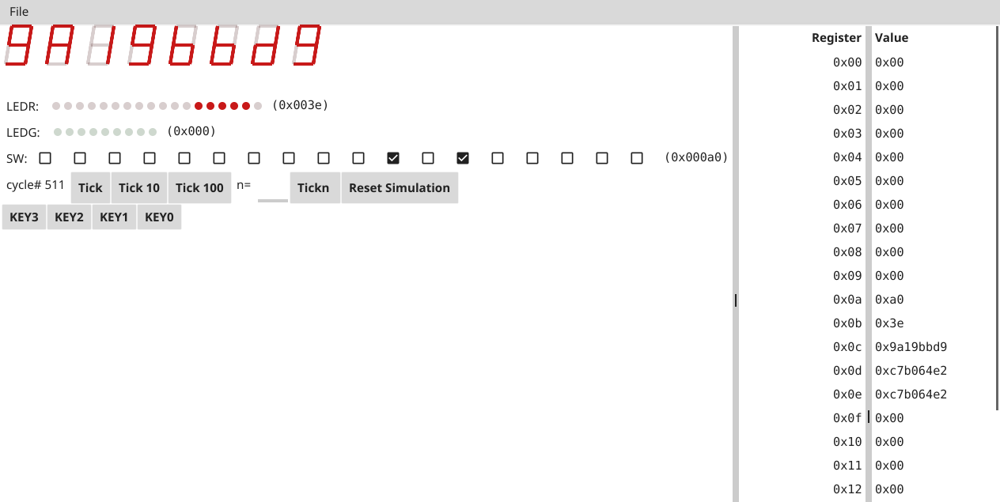

# de2gui

This package implements a facsimile of some of the intractable components of
the [Terasic
DE2-115](https://www.terasic.com.tw/cgi-bin/page/archive.pl?Language=English&No=502)
development board created in support of the University of South Carolina
CSCE611 "Advanced Digital Design" course.

Due to COVID-19, the course has moved to an online format. This package was
created to give students a similar experience to interacting with the physical
DE2 boards, rather than just staring at waveforms and debugger output.

This package is not a full standalone simulation environment, only the
graphical front-end. Within the context of the course, we use Cgo to interface
this GUI with [Verilator](https://www.veripool.org/wiki/verilator), which is
used to convert the student's Verilog code into a C++ simulation.

This package is released under an open-source license, in the hopes that it may
be of use to other instructors and to hobbyists.

**Note for CSCE611 students:** you are most welcome to look around in this
repository, and to open issues or submit pull requests. **However, you should
not use the issue tracker on this repository to ask questions relating to the
course or the course projects**.

*Screenshot of de2gui in action*

Also check out [the demo application](./cmd/de2gui_demo).

# License

See [`./LICENSE`](./LICENSE)

# Contributing

Feel welcome to open issues or submit pull requests. If you would like to
implement a new feature, please open an issue and discuss your plan, so we
can avoid duplicated work and reduce the chances of merge conflicts later.

## Roadmap

A feature can have one of several statuses:
* Planned -- we plan to add this feature ourselves.
* Wanted -- we are not planning to add this feature ourselves, but would like
  it if someone else added it and submitted a PR.
* Indifferent -- we don't need this feature for our use case, but would merge
  it in a PR if someone else submitted it.
* Unwanted -- we don't want this feature and would not merge a PR with it.

| Feature | Status |
|--|--|
| More realistic, custom KEY/SW widgets | Wanted |
| Support for the DE2-115 LCD Display | Indifferent |
